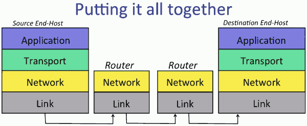
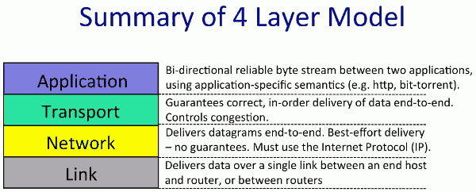
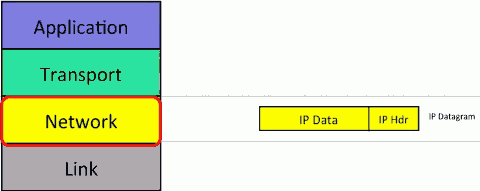
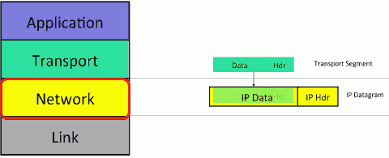
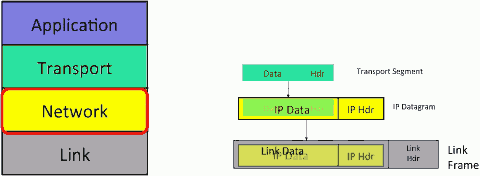
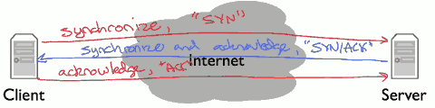
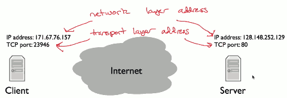
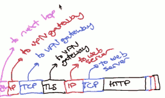

# week1 Introduction

## 1.2 The 4 Layer Internet Model 

The Internet is made up of end-hosts, links and routers. Data is delivered hop-by-hop over each link in turn. Data is delivered in packets. 

1. Link 
    - The Link layer's job is to carry the data over one link at a time. 
    - Ethernet and wifi are 2 examples of different Link layers. 
2. Network
    - The network lyaer's job is to deliver packets end-to-end across the Internet from the source to destination. 
    - Network layer packets are called datagrams: `|Data|from|to|`.  They consist of some data and a header containing the "To" and "From" addresses --just like we put the "To/From" address on a letter. 
    - The Network hands the datagram to the Link layer , telling it to send the datagram over the first link. In other words, the Link Layer is providing a *service* to the Network Layer: "if you give me a datagram to send, I will transmit it over one link for you". 
    - At the other end of the link is a router. The Link layer of the router accepts the datagram from link, and hands it up to the Network layer inside the router. The network lyaer on the router examines the destination address of the datagram, and is responsible for routing the datagram on hop at a time towards its eventual destination. It does this by sending to the Link layer again, to carry it over the next link.
    - and so on until it reaches the Network layer at the destination. 
    - **The Network layer provides an unreliable datagram delivery service.**
3. Transport
    - The most common Transport Layer is TCP (Transmission Control Protocol). 
    - TCP makes sure that data sent by an application at one end of the Internet is correctly delivered in the right order, to the application at the other end of the Internet. If the Network layer drops some datagrams, TCP will retransmit them, multiple times if need-be. 
    - If an application doesn't need reliable delivery, it can use the much simple UDP (User Datagram Protocol) instead. UDP offers no delivery guarantees. 
4. Application
    - BitTorrent, Skype, www ... 


### The network layer is "special"

We must use the Internet Protocol (IP)

- IP makes a best-effort attempt to deliver our datagrams, but it makes no promises. 
- IP datagrams can get lost , out of order, and can be corrupted. There are no guarantees.

If an application wants a guarantee that its data will be retransmitted when necessary and will be delivered to the applicaiton in order and without corruption then it needs another protocol running on top of IP. 

This is the job of the Transport Layer ...

### Summary






## 1.3 The IP service model

### The Internet Protocol (IP)

Walking through the service provided by the Internet Protocol.



IP datagrams consist of a header and some data. 

When The transport layer has data to send, it hands a Transport Segment to the Network layer below.  The network layer puts the transport segment inside a new IP datagram. 

IP's job is to deliver the datagram to the other end. 



But first , the IP datagram has to make it over the first link to the first router. 

So the IP sends the datagram to the Link Layer that puts it inside a Link Frame, such as an Ethernet package and ships it off to the first router. 




### The IP Service Model

Property | Behavior
--- | ---
Datagram | Individually routed packets, hop-by-hop routing (just like how letters are routed by the postal service)
Unreliable | Packets might be dropped
Best effort | ... but (drop) only if necessary 
Connectionless | No per-flow state, packets might be mis-sequenced.

### Why is the IP service so simple ?

- Simple, dumb, minimal:  Faster, more streamlined and lower cost to build and maintain. 
- The end-to-end principle: Where possible, implement features in the end hosts. 
- Allows a variety of reliable (or unreliable) services to be built on top.
- Works over any link layer: IP makes very few assumptions about the Link layer below. 

### The IP Service Model (Details)

5 features , understand the scope of the complete IP service.

1. Tries to prevent packets looping forever
    - It is possible for the forwarding table in a router to be wrong, causing a packet to start looping round and round following the same path. 
    - This is most likely to happen when the forwarding tables are changing and they temporarily get into an inconsistent state. 
    - Rather than try to prevent loops from ever happending -- which would take a lot of complexity -- IP uses a very simple mechanism to catch and then delete packets that appear to be stuch in a loop. To do this, IP simply adds a hop-count field in the header of every datagram. It is called the TTL(time to live) field, starts out a number like 128, and then is decremented by every router it passes through. 
2. Will fragment packets if they are too long.
    - Most links have a limit on the size of the packets they can carry. 
        - For example, Ethernet can only carray packets shorter than 1500bytes long. If an application has more than 1500 bytes to send, it has to be broken into 1500 pieces before sending in an IP datagram.
        - Now along the path towards the destination, a 1500 bytes datagram might need to go over a link that can only carry smaller packets, for example 1000 bytes.  
        - The router connecting the 2 links will fragment the datagram into 2 smaller datagrams.
    - IP provides some header fields to help the router fragment the datagram into 2 self-contained IP datagrams, while providing the information the end-host needs to correctly reassemble the data again. 
3. Uses a header checksum to reduce chances of delivering datagram to wrong destination. 
    - IP includes a checksum field in the datagram header to try and make sure datagrams are delivered to the right location. It could be quite a security problem if packets are accidentally and frequently sent to the wrong place because of a mistake by a router along the way. 
4. Allows for new version of IP
    - Currently IPv4  with 32 bit addresses
    - And IPv6 with 128 bit addresses
5. Allows for new options to be added to header. 
    - This is a mixed blessing. On the one hand, it allows new features to be added to the header that turn out to be important, but weren't in the original standard. On the other hand, these fields need processing and so require extra features in the routers along the path, breaking the goal of simple, dumb, minimal forwarding path.
    - In practice, very few options are used or processed by the routers. 


### IPv4 Datagram


- Protocol ID 
    - That tells use what is inside the data filed.
    - Essentially, it allows the destination end-host to demultiplex arriving packets, sending them to the correct code to process the packet.  
    - If the protocol ID has the value "6", then it tells us the data contains a TCP segment, and so we can safely pass the datagram to the TCP code and it will be able to parse the segment correctly. 
    - The Internet Assigned Numbers Authority (IANA) defines over 140 different values of Protocol ID, representing different transport protocols. 
- Version 
    - tells us which version of IP,  currently  the legal values are IPv4 and IPv6.
- Total Packet Length
    - can be up 64k bytes including the header and all the data. 
- TTL 
    - help to prevent packets accidentally looping in the network forever. 
- Packet ID, Flags, Fragment Offset
    - Sometimes a packet is too long for the link it is about to be sent on.  The Packet ID, Flags and Fragment Offset all help routers to fragment IP packets into smaller self-contained packets if need-be. 
- Type of Service
    - which gives a hint to routers about how important this packet is. 
- Header Length (, (OPTIONS), (PAD) )
    - tells us how big the header is -- some headers have optional extra fields to carry extra information. 
- Checksum 
    - a checksum is calculated over the whole header so just in case the header is corrupted, we are not likely to deliver a packet to the wrong destination by mistake.

## 1.4 Life of a Packet 

### TCP Byte Stream 

- 3-way handshake 
    - SYN, SYN/ACK, ACK
    - 
- Opening a TCP connection to a program need 2 addresses. 
    1. IP address,  the addresses the network layer uses.
    2. TCP port, tells the computer software which application to deliver data to.
    - 

### Inside Each Hop

How does a router make decision ?  It use something called *forwarding table*. 

dest | link
--- | ---
0.0.0.0/0 (default) | 1
171.33.0.0/16 (pattern A) | 5
23.0.0.0/8 (B) | 2
28.33.5.0/24 (C)| 4
171.32.0.0/16 (D) | 2
67.0.0.0/8 (E) | 6
216.0.0.0/8 (F) | 1

When a packet arrives, the router checks which forward table table's entry pattern best matches the packet, it forward that packet along that entry's link. 

The default router is the least specific pattern , it matches every IP address. The default router is used specially for a edge networks. 

### Under the Hood

- Request web page from www.cs.brown.edu
- Use wireshark to see TCP byte stream establishment and data exchange
    1. set wireshark filter:  `tcp.port==80 && ip.addr==128.148.32.12`
    2. then select the enthernet, say `en1`
    3. **Start** wireshark
    4. next open web browse to visit www.cs.brown.edu. You can see packets in wireshark.
- Use traceroute to see route packets take through Internet.
    - `traceroute -w 1  www.cs.brown.edu`


## 1.5 Packet switching principle

**Packet**: A self-contained unit of data that carries information necessary for it to reach its destination.  Packet switching is the idea that we break our data up into discrete, self-contained chunks of data. Each chunk, called a packet, carries sufficient information that a network can deliver the packet to its destination. 


**Packet switching**: Independently for each arriving packet, pick its outgoing link. If the link is free, send it. Else hold the packet for later. 

each packet contains an explicit route, specifying the IDs of each packet switch along the way. 

```
DATA | DEST  C B A 

src -- A -- B -- C -- dest
```

We call this "self routing" or "source routing", because the source specifies the route. When the source sends a packet, it puts in the packet "A,B,C,destination". It turns out the Internet supports source routing , but its generally turned off because it raises big security issues.

One simple optimization , and what the Internet mostly does today, is to place a small amount of state in each switch which tells it which next hop to send packets to.  In this model, all the packet needs to carry is the destination address.  Using the address, each switch along the way can make the right decision. 


### Two consequences 

1. **Simple** packet forwarding
    - No per-flow state required ( Flow: A collection of datagrams belonging to the same end-to-end communication, e.g. a TCP connection )
2. **Efficient** sharing of links

### Data traffic is bursty

- Packet switching allows flows to use all available link capacity.
- Packet switching allows flows to share link capacity.

This is called *Statistical Multiplexing*.


## 1.7 Encapslation principle

- Encapsulation allows you to layer recursively
- Example: Virtual Private Network (VPN):
    - HTTP(web) application payload in
    - a TCP transport segment in 
    - an IP network packet in 
    - a secured TLS presentation message in 
    - a TCP transport segment in 
    - an IP network packet in 
    - an Ethernet link frame .




## 1.8 Byte Order

Network byte order is big endian 

```
1024 = 0x400 =  | 0x40 | 0x00 | 
```

### Portable Code

- Different processor have different endianness
    - Little endian: x86,  big endian: ARM
- You have to convert network byte order values to your host order 
- Helper functions:  htons(), ntohs(), htonl(), ntohl()
    - htons: host to network short
    - ntohl: network to host long 
    - 
    ```c
    uint16_t http_port = 80 ; // host order
    unit16_t packet_port = ntohs( packet->port ) ; 
    if (packet_port == http_port ) {
        ... // OK
    }
    ```


## 1.9 IPv4 address

- Netmask: apply this mask, if it matches, in the same network
    - Netmask of 255.255.255.0 means if the first 24 bits match
    - Netmask of 255.255.252.0 means if the first 22 bits match
    - Netmask of 255.128.0.0 means if the first 9 bits match
    - Smaller netmask (fewer bit 1s)  means large network.
- Classless Inter-Domain Routing(CIDR)
    - Address block is a pair: address,count
    - 171.64.0.0/16 means any address in the range 171.64.0.0 to 171.64.255.255
    - A /24 describes 256 addresses, a /20 describes 4096 address.


## 1.11 Address Resolution Protocol (ARP)

ARP is the mechanism by which the network layer can discover the link address associated with a network address it's directly connected to.  Put another way, it's how a device gets an answer to the question: "I have an IP packet whose next hop is this address -- what link address should I send it to?"

ARP is needed because each protocol layer has its own names and addresses. 

An IP address is a network-layer address. i.e. Host: 171.67.76.65

A link address, in contrast, describes a particular network card, a unique device that sends and receive link layer frames.  Ethernet, for example, has 48bit address. Interface: 00:13:72:4c:d9:6a

The fact that link layer and network layer address are decoupled logically but coupled in practice is in some ways a histroical artifact. 

Furthermore , there turns out to be a bunch of situations where having a separate link layer address is very valuable. 

For an example , when I register a computer computer with Stanford's network, I register its link layer address, the adress of the network card. So what does this mean in practice? 

```
computer A
192.168.0.6
netmask: 255.255.255.0
gateway: 192.168.0.1
00:13:72:4c:d9:6a

gateway 
192.168.0.1
00:18:e7:f3:ce:1a
171.43.22.8
00.18.e7.f3.ce.1b

computer B
171.43.22.25
9:9:9:9:9:9
```  

Let's say node A  , wants to send a packet to node B.  It's going to generate an IP packet with source address 192.168.0.5 and destination address 171.43.22.25. A checkes whether the destination address is in the same network. The netmask tells it that the destination address is in a different network. This means node A needs to send the packet through the gateway, or 192.168.0.1. To do this , it sends a packets whose network layer destination is 171.43.22.5, but whose link-layer destination is the link layer address of the gateway. So the packet has a network layer destination 171.43.22.5 and a link layer destination 00:18:e7:f3:ce:1a.  So we have an IP packet from A to B, encapsulated inside a link layer frame from A to the gateway.  When the packet reaches the gateway, the gateway looks up the next hop. decides it's B, and puts the IP pakcet inside a link layer frame to B. 

So here we get to the problem ARP solves. A knows that it needs to send a packet through the gateway that has IP address 192.168.0.1. To do so, it needs to have the link layer address associated with 192.168.0.1.  How does it get the address?  We somehow need to be able to map a layer 3 ( network layer) address,  to its corresponding layer 2(link layer) address. We do this with a protocol called **ARP**. 

- ARP
    - Generates mapping between layer2 and layer3 address
        - Nodes cache mappings, cache entries expire
    - Simple request-reply protocol
        - "Who has network address X?"
        - "I have network address X."
    - Request sent to link layer broadcast address
    - Reply sent to requesting address ( not broadcast)
    - Packet format includes redundant data 
        - Request has sufficient information to generate a mapping 
        - Makes debugging much simpler
    - No "sharing" of state: bad state will die eventually


