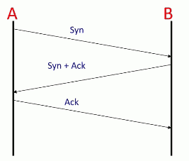

# Week2 Transport Layer

## 2.1 TCP Service Model

TCP is an example of transport layer. TCP provides reliable, end-to-end, bi-directional byte-stream service. 

When 2 applications use TCP, they establish a 2-way communication channel between the TCP peers at both ends.  Fist TCP establishes a communication channel from A to B , then it establishes a channel from B to A. 

We call the 2-way communication a "connection". 

At both ends of the connections, TCP keeps a state machine to keep track of how the connection is doing. 


### Connection setup 3-way handshake

1. First of all, Host A sends a message to B , indicating that the TCP layer at A wants to establish a connection with the TCP layer at B. 
    - The message is called a SYN message, which is short for synchronize, because A also sends along the base number it will use to identify bytes in the byte stream. If it sends '0' then the numbers will start at 0.  If it sends 1000, then they will start at 1000.
2. B responds with what we call a SYN+ACK. B signal an ACK because B is acknowledging A's request and agreeing to establish the communication from A to B. The TCP layer at B also sends a SYN back to A to indicate that to indicate that it wants to establish a connection with the TCP layer at A
    - It sends a number too, indicating the starting number for the byte stream in the reverse direction. 
3. Finally, A responds with an ACK to indicate that it is accepting the request for communication in the reverse direction. 
    - The connection is now setup in both directions.



### TCP "stream of bytes" service

The hosts send data to each other as if it is from a continuous stream of bytes. 


The stream of bytes is delivered by TCP segments. A puts bytes from the stream into a TCP segment, hands it to the IP layer which delivers it to B. 


The TCP layer at B extracts the bytes to recreate the byte stream and delivers them to the application at B. 


In practice, the TCP segment may need to be transmitted multiple times, in the case a segment is dropped along the way,  or if A doesn't receive an acknowledgment.

The TCP segment can be as smaller as 1 byte, for example, if you are typing characters in an ssh session, each character is sent one at a time, rather than waiting for the whole segment to fill up. This isn't very efficient when we have lots of data to send; so we can fill the TCP segment all the way up to the maximum IP datagram size. 

### Connection teardown

When A and B have finished sending data to each other, they need to close the connection. We say they "teardown" the connection, which means they tell each other they are closing the connection and both ends can clean up the state associated with the state machine.

1. The TCP layer at A can close the connection by sending a FIN message, which is short for FINISH. 
2. B acknowledges that A no longer has data to send and stops looking for new data from A. But B might still have new data to send to A and is not ready to close down the channel from B to A. So the message from B to A carrying the ACK can also carry new data from B to A. B can keep sending new data to A as long as it needs to.
3. Sometime later B finishes sending data to A, and now sends its own FIN to tell A they can close the connection. 
4. A replies by sending an ACK to acknowledge that the connection is now closed. 
    - Because both directions have finished, the connection is now fully closed and the state can be safely removed. 


### The TCP Service Model

Property | Behavior
--- | --- 
stream of bytes | reliable byte delivery service
reliable delivery | 1.acknowledgments indicate correct delivery
· | 2.checksums detect corrupted data
· | 3.sequence numbers detect missing data
· | 4.flow-control prevents overrunning receiver
in-sequence | data delivered to application in sequence transmitted
congestion control | controls network congestion

When a TCP layer receives data, it sends an acknowledgment back to the sender to let it know the data arrived correctly. 

Checksums detect corrupted data. The TCP header carries a checksum covering the header and data inside the segment. The checksum is there to detect if the segment is corrupted along the way, for example by a bit-error on the wire or by a memory fault inside a router.

Sequence numbers detect missing data. Every segment's header carries the sequence number , in the stream of bytes , of the first byte in the segment. For example, if the 2 sides agree that the sequence number start at 1000, then the first segment will have a sequence number of 1000. If the segment carries 500 bytes of data then the next segment will carry the sequence number 1500. If a segment gets lost, then the sequence number will be incorrect and the TCP layer knows some data is missing. It is possible it will show up later , perhaps it took a longer path, or it might have gone missing, in which case the sender will need to resend the data.

Flow-control prevents overrunning the receiver. If A is much faster than B then it's possible for A to overwhelm B by sending data so fast that B can't keep up. In TCP, the receiver keeps telling the sender if it can keep sending, specifically, it tells the sender how much room it has in its buffers to accept new data. 

### The TCP Segment Format

The *Source port* tells the TCP layer at the other end which port it should use to end data back again. When a new connection starts, the initiator of the connection, in our case A, generates a unique source port number, to differentiate the connection from any other connections between A and B to the same service. 

The sequence number indicates the position in the byte stream of the first byte in the TCP data field. For example, if the initial sequence number is 1000, and this is the first segment, then the sequence number is 1000. If the segment is 500 bytes long, then the sequence number in the next segment will be 1500 and so on.

The acknowledgment sequence number tells the other end which byte we are expecting next. It also says that we have successfully received every byte up unitl the the one before this byte number. 

- Flags:
    - ACK/SYN/FIN 
    - PSH , tells the TCP layer at the other end to deliver the data immediately upon arrival,  rather than wait for more data. This is useful for short segments carrying time critical data, such as a key stroke. We don't want the TCP layer to wait to accumulate many keystrokes before delivering them to the application.


### The Unique ID of a TCP connection

A TCP connection is uniquely identified by 5 pieces of information in the TCP and IP header.

IP source and destination address, IP protocol ID(TCP), TCP source and destination ports. 

Now, the unique ID only holds if a few things hold.

First, we need make sure A, the initiator of the connection, picks a unique source port ID. We need make sure it doesn't accidentally pick the same source port number it is already used with another connection to the same service on B. A uses a simple method to minimize the chances: it increments the source port number for every new connection. 

There is also a very slight danger that if A suddenly creates a lot of new connections to B, it might still wrap around and try to create 2 connections with the same global ID. If this happened, the bytes from one connection might become confused with the bytes from another connection. This could happen, for example, if a TCP segment somehow lived for a long time in the network. stuck inside a router buffer , or circulating in a temporary loop. To reduce the chances of confusion, the TCP connections initialize with a random initial sequence number(ISN<sub>A</sub>) to refer the bytes in the byte stream.

## 2.2 UDP

UDP is used by applications that don't need the guaranteed delivery service of TCP, either because the application handles retransmissions in its own private way, or simply just doesn't need reliable delivery. 

UDP is much much simpler than TCP. All UDP does is take application data and create a UDP datagram, then hands it to the network layer. The UDP datagram identifies the application that the data should be sent to at the other end. 


### User Datagram Protocol (UDP)

Property | Behavior
--- | --- 
Connectionless Datagram Service | No connection established. Packets may show up in any order
Self contained datagrams | ·
Unreliable delivery | 1.No acknowledgments
· | 2.No mechanism to detect missing or mis-sequenced datagrams
· | 3.No flow control

UDP sounds very much like the service provided by the IP layer. 

UDP is used by applications that don't need reliable delivery, such as simple request-response applications. DNS, the domain name system used by the internet to turn a hostname into an IP address uses UDP because the requset is fully contained in one UDP datagram. If we send a DNS request containing a hostname, the DNS server will respond with an IP address.  If the request is unsuccessful , it simply times out and resent.  The DHCP or Dynamic Host Configuration Protocol also uses UDP.  The Network Time Protocol(NTP) also use UDP.

Some other applications use UDP because they have the own special needs for retransmission, congestion control and in-sequence delivery. For example a few real-time streaming audio/video services use UDP. This is much less common than it used to be because most audio/video streams of HTTP today use TCP instead of UDP, because they're built on top of HTTP. 


## 2.3 The Internet Control Message Protocol (ICMP) Service Model

It used to report errors and diagnose problems with the network layer. You'll recall that IP doesn't provide any guarantees about delivery, but it does help and it'll prove to be a very valuable tool to get some hints and some information back from the network layer, to tell us about when the things are going wrong. 


### 3 mechanisms make the Network Layer work

1. IP
    - the creation of IP datagrams
    - hop-by-hop delivery from end to end
2. Routing Tables
    - Algorithms to populate router forwarding tables. 
3. ICMP (this video)
    - Communicates network layer information between end hosts and routers
    - Reports error conditions
    - Helps us diagnose problems


### ICMP runs above the Network Layer

Strictly speaking it's a transport layer protocol. 

When an end host or router want to report an error using ICMP, it puts the information that it wants to send back to the source into an ICMP payload. And hands it to IP , to be sent as a datagram.


### The ICMP Service Model 

Property | Behavior 
--- | ---
Reporting Message | Self-contained message reporting error
Unreliable | Simple datagram service -- no retries 

### How "ping" use ICMP

```
ping B 
```


The ping application calls ICMP directly. IT sends a ICMP echo request. And so that will be a message that goes into the network. 

The IP datagram (encapuslates ICMP) is gonna go off to B. 

Eventually it'll reach B. And then B is gonna see this, and what B is required to do is to send an echo reply. 


### How "traceroute" uses ICMP

The gola of tranceroute is to find the routers on the path from A to B. It's trying to identify the 2 routers along the path, and measure the round trip time of packets from A to each of those routers. Traceroute does this by sending UDP messages.

A is gonna send a UDP message, encapsulated into an IP datagram which TTL field in IP header is set to 1. So this will be sent over the link from A to the first router,  the router decrement the TTL and then discard the packet because the TTL is 0.  One more thing that the router is required to do is to send back an ICMP message with type 11.  When this reaches A, A knows the address of the first router and can loops up its name. A can measuring the time that it took from when it sent the original IP message until it received this ICMP reply, it now knows the round trip time to that router. 

Next A is going to send a UDP message , put into an IP datagram, and that is gonna have a TTL of 2.

It'll do this until eventually the message finds its way to B.  That UDP message that it sends is using a weird destination port number, it deliberately picks one that B is not going to know, so that B will send back a ICMP message that says "port unreachable" so that A knows the traceroute is complete. 


## 2.4 The End-to-End Principle

The End-to-End Principle refers to 2 different principles: 

1. the first deals with correctness.
2. the second, which we called the "strong" end-to-end principle, is much broader and general.


Now, one could say "Look, I know the packet won't be corrupted on any link, because I have my checks(error detection on link). Since it won't be corrupted on any link, it won't be corrupted at all. Therefore, if it arrives successfully at destination, there's no corruption, and the file has arrived successfully."

This assumption turned out to be wrong, The is what happened : one of the computers in the transfer path, let's say computer D, had buggy memory, such that sometimes some bits would be flipped. D received packets of data, checked them, and found them correct. It would then move them into main memory, at which point they would become corrupted. D then forward the packet, but because error detection occus on the link, from the link's perspective the packet looked fine and it would pass E's check?  The link error detection was designed for errors in *transmission* not errors in storage. 

The only way to be sure the file arrives correctly is to perform and end-to-end check.  When the source sends the file, it includes some error detection information. When the destination reassembles the file, it checks whether the file has any errors.  This is the only way one can be sure it arrived correctly.  The network can help, but it can't be responsible for correctness.


As another concrete example, think of TCP, TCP provides a service of reliable byte stream. But the reliability isn't perfect. There is a chance that TCP delivers some bad data to you, so you need to perform an end-to-end check on the data. BitTorrent does this, for example. It uses TCP to transfer chucks, and after each chunk is complete it checks that it arrived successfuly using a hash. 

For something to work correctly, it has to be done end-to-end. You can do stuff in the middle to help as performance improvements, but if you don't rely on end-to-end then at some point it will break. 

### "Strong" End to End

The network's job is to transmit datagrams as efficiently and flexibly as possible. Everything else should be done at the fringes...  -[RFC 1958]

## 2.5 Error Detection

### 3 schemes : Checksum, CRC and MAC

- Checksum adds up values in packet (IP,TCP)
    - very fast, cheap to compute even in software
    - Not very robust
        - if 1 bit error adds 32, and another bit error subtracts 32, then the checksum won't catch the error. 
- Cyclic redundancy code computes remainder of a polynomial (Ethernet)
    - More expensive than checksum (easy today, easy in hardware)
    - Protects against any 2 bit error, any burst ≤ c bits long, any odd number of errors
- Message authentication code(or MAC): cryptographic transformation of data (TLS) 
    - Robust to malicious modification , but not errors
    - If strong, any 2 message have a 2<sup>-c</sup> chance of having the same data.
    - But they're actually not great for catching errors. 
        - If I have 16-bit CRC, I'm assured that I'll detect a burst of errors that is 16 bits long or shorter. 
        - If I have a 16-bit MAC, I'm only assured that I'll detect bit errors with very high probability , 99.998%., or 1/65536. 
- Each layer has its own error detection: end-to-end principe!


Algorithm | single bit error | run of 2 bit errors | run of 9 bits errors | Two bit errors 100 bits apart 
--- | --- | --- | --- | ---
8-bit checksum | Y | N | N | N
16-bit checksum | Y | N | N | N 
8-bit CRC | Y | Y | N | N 
16-bit CRC | Y | Y | Y | N
32-bit MAC | N | N | N | N 


Bug guarantee is a very strong statement. While 16-bit checksum can't guarantee that it will catch a run of 9 bit errors, there's a high probability it will.  Similarly, a 16-bit CRC has a very high probability of detecting two bit errors 100 bits apart. And In practice, high probability is often good enough. 

 


