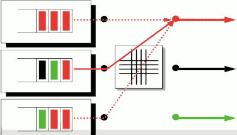
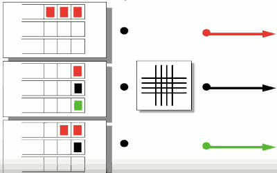

...menustart

- [3 Packet Switching](#95d6e5152b7a7860c3f678b860a08f31)
    - [Principles](#d96870a2167c8e557765bc04d6a4050c)
    - [Switching and Forwarding 1](#941dc1ecaf7cb2c27e73856e25d5c8f0)
        - [Generic Packet Switch](#2d8ccad07e004421be4300559351e27d)
        - [Ethernet Switch](#df9e078a63b5048a6e949099474a7d52)
        - [Internet Router](#91788f80199037e9f0d6952b91dfbddc)
        - [Basic Operations](#b5794bba6843c21acafdd6a4bfd776be)
        - [Lookup Address: Ethernet](#b7b5b2d8dfb76fc68801f4c6b1a96534)
        - [Lookup Address](#01faf3e37dc5da6c3d06bcce4e2e7aa4)
        - [Longest prefix match lookup implementation](#8c0068443e2c8016df017a23fa88db64)
        - [Lookup Address: Generic](#9f9ebfc8cd2115dde70b4cad2c81968f)
    - [Switching and Forwarding 2](#e0b9104f39f204f723da319e32f1b7a0)
        - [Output Queued Packet Switch](#554d9652b25833d8ea915399758d888b)
        - [Input Queued Packet Switch](#c142861869c041b9ec2a340edc3e58b6)
        - [Virtual Output Queues](#d8499a9391a36ede4c218af4eeda56e4)
        - [Properties of Output Queued switches](#3c5a9eb035d099c3a7a125772448aba1)

...menuend


<h2 id="95d6e5152b7a7860c3f678b860a08f31"></h2>


# 3 Packet Switching 

<h2 id="d96870a2167c8e557765bc04d6a4050c"></h2>


## Principles

- End to end delay is made up of 3 main components
    - Propagation delay along the links (fixed)
    - Packetization delay to place packets onto links (fixed)
    - Queuing delay in the packet buffers of the router (variable)
- Some real-time application use playback buffers to absort the variation in queuing delay.


<h2 id="941dc1ecaf7cb2c27e73856e25d5c8f0"></h2>


## Switching and Forwarding 1

<h2 id="2d8ccad07e004421be4300559351e27d"></h2>


### Generic Packet Switch

1. Lookup Address
    - forwarding table
2. Update Header
    - for example, if it's an Internet router we have to decrement the TTL and update the checksum.
3. Queue Packet
    - Buffer Memory

<h2 id="df9e078a63b5048a6e949099474a7d52"></h2>


### Ethernet Switch

1. Examine the header of each arriving frame
2. If the Ethernet Destination Address is in the forwarding table, forward the frame to the correct output port(s)
3. If the Ethernet DA is not in the table, broadcast the frame to **all** ports(except the one through which the frame arrived)
4. Entries in the table are **learned** by examining the Ethernet SA of arriving packets.


<h2 id="91788f80199037e9f0d6952b91dfbddc"></h2>


### Internet Router 

1. If the Ethernet DA of the arriving frame belongs to the router, accept the frame, else drop it.
    - it's dealing with IP datagrams that are encapsulated in Ethernet packets.
2. Examine the IP version number and length of the datagram
3. Decrement the TTL, update the IP header checksum
4. check to see if TTL==0 , if it does, drop it.
5. If the IP DA is in the forwarding table, forward to the correct egress port(s) for the next hop.
6. Find the Ethernet DA for the next hop router
7. Create a new Ethernet frame and send it


<h2 id="b5794bba6843c21acafdd6a4bfd776be"></h2>


### Basic Operations

1. Lookup Address
    - How is the address looked up in the forwarding table ?
2. Switching
    - How is the packet sent to the correct output port ?


At a high level, Ethernet switches and Internet routers perform similar operation.

Address lookup is very different in switches and routers.  


<h2 id="b7b5b2d8dfb76fc68801f4c6b1a96534"></h2>


### Lookup Address: Ethernet 

Ethernet address (in a switch)

Match | Action 
--- | ---
Ethernet DA = 0xA8B72340E678 | Forward to port 7
Ethernet DA = 0xB3D22571053B | Forward to port 5
... | ...


- Methods:
    - Store addresses in hash table (maybe 2-way hash)
    - Look for exact match in hash table

<h2 id="01faf3e37dc5da6c3d06bcce4e2e7aa4"></h2>


### Lookup Address 

IP address ( in a router )

Match | Action
--- | --- 
IP DA = 127.43.57.99  |  Forward to 56.99.32.16
IP DA = 123.66.44.x  |  Forward to 22.45.21.126
IP DA = 76.9.x.x  | Forward to 56.99.32.16
... | ...


Lookup is a **longest prefix match** , not an exact match


<h2 id="8c0068443e2c8016df017a23fa88db64"></h2>


### Longest prefix match lookup implementation

Binary Trie tree

if 0 go left child , if 1 go right child

Entry | Prefix
--- | ---
a | 00001
b | 00010
c | 00011
... | ...
i | 1100
j | 11110000

---

Ternary Content Addressable Memory (TCAM)

Entry | Prefix
--- | ---
a | 00001xxx
· | 11111000
b | 00010xxx
· | 11111000
c | 00011xxx
· | 11111000
... | ...
j | 11110000
· | 11111111


<h2 id="9f9ebfc8cd2115dde70b4cad2c81968f"></h2>


### Lookup Address: Generic 

Generic or abstract lookups <Match,Action>

Match | Action
--- | ---
IP DA = X  | forward to port 7
Eth DA=Y and IP DA=Z  | drop packet

Generalization of lookups and forwarding action in switches, routers, firewalls, etc.


<h2 id="e0b9104f39f204f723da319e32f1b7a0"></h2>


## Switching and Forwarding 2

Switching packets to the egress port 

- Output queuing and shared memory
- Input queuing and head-of-line blocking
- Virtual output queues

<h2 id="554d9652b25833d8ea915399758d888b"></h2>


### Output Queued Packet Switch 

When we have packets arriving,  it's possible in the worst case that all the packets coming in at the same time will be wanting to go to the same output queue.

```
R \    /(q)  R
R -->---(q)  R
R /    \(q)  R
```

So if we have N input ports each running at rate R , then in the worst case we could actully have a writing rate of *N·R* into this output queue. 

Similarly we always have a reading rate from this queue of rate R. 

So we say in this output-queue switch that the output buffer memory must run on  aggregate a total rate of up to *(N+1)·R* .

The somewhat annoying thing, or frustrating thing about this is that long term, it can't possibly be the cast that we're writing into this queue at rate N·R. The system could not sustain that.  This only really works if some mechanism is in play like congestion control to hold the average rate (each input port) of writing into this queue no more than one R.

Output-queue switches are said to be limited by this problem that have have to have memory that run very,very fast. And it becomes quite a challenge when building scalable output queued switches to create memory hierarchy that will run fast enough. 

One obvious way to solve this problem is to move the queues from the output over to the input. 


<h2 id="c142861869c041b9ec2a340edc3e58b6"></h2>


### Input Queued Packet Switch 

```
R (q) \    /  R
R (q) -->---  R
R (q) /    \  R
```

If 2 packets with same DA would come through the switch, only 1 of them needs to be held.  People often say that input-queued switches are much more scalable, indeed quite a few big switches are made this way, but with caveat, there is a problem :  head of line blocking.



The problem is, that you can only send one of them(red packets) at a time. Even though there are green and black packets in the system that could go to these unused outputs. 

Natural solutions to this, which is pretty widely used is something called Virtual Output Queues.

<h2 id="d8499a9391a36ede4c218af4eeda56e4"></h2>


### Virtual Output Queues 

Each input maintains a separate queue for each output. 


 

<h2 id="3c5a9eb035d099c3a7a125772448aba1"></h2>


### Properties of Output Queued switches 

1. They are "work conserving"
2. Throughput is maximized 
3. Expected delay is minimized


The simplest and slowest switches use *output queuing* which minimizes packet delay.

Hight performance switches ofen use *input queuing* , with virtual output queues to maximize throughput.


