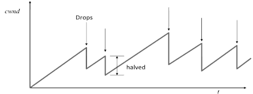
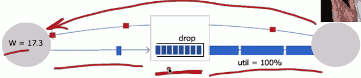
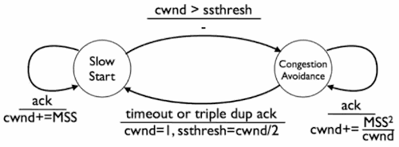
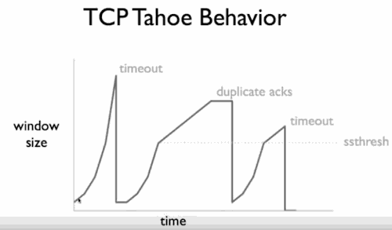

# 4  Congestion Control

You can imagine that if senders were to send too many packets into the network, ther are going to overwhelm the network. The buffers of routers are going to fill up, the links are going to overflow, and we're going to start dropping packets. 

Congestion control is about preventing the senders from overwhelming the network. 

In this unit, we're going to talk about TCP and how TCP controls congestion. 

### Outline

- What is congestion control ?
- Basic approaches 
    - in the network
    - from the end host
- TCP Congestion Control
    - TCP Tahoe
    - TCP Reno
    - TCP RTT Estimation
    - Performance in practice


## 4.1 Basic


### Max-min fairness: Single Link

```
A(0.5) \
B(1)   ---- Router (1)----
C(0.2) /
```

What would be the fair share?

C is the minimum. So we're going to start by allocating the minimum. 

The fair share of A,B,C is 1/3. And C wants less than its fair share.  So we're going to allocate to it 0.2. That's going to leave 0.8 on Router's link. And the fair share of the other two would be 0.4. A wants more than that so it's going to be curtailed to 0.4.  B also wants more , so it's gonna get 0.4 as well.

```
A(0.5) \
B(1)   ---- Router (A/0.4, B/0.4, C/0.2)---- 
C(0.2) /
```

### Goals for congestion control 

1. High throughput:  Keep links busy and flows fast
2. Max-min fairness
3. Respond quickly to changing network conditions
4. Distributed control

### TCP Congestion Control

TCP implements congestion control at the end-host

- Reacts to events observable at the end host(e.g. packet loss)
- Exploits TCP's sliding window used for flow control
- Tries to figure out how many packets it can safely have outstanding in the network at any time.
- Varies window size according to AIMD.


- Sliding Windows


```
           |<-------- Window Size ------>|
|||||||||||||||||||||||||||||||||||||||||||||||||||||||
           |                 |           |
Data ACK'd |Outstanding Data |  Data OK  | Data not OK
           |sent,but un-ack'd|  to Send  | to send yet
```


TCP varies the number of outstanding packets in the network by varying the window size:

Windwos size = min{ Advertised window (Receive) , Congestion Window (Transmitter) }

Congestion window (CWND) is calculated at the source.

How do we decide the value for cwnd ?

The scheme that we're going to use is AIMD( additive increase, multiplicative decrease ).

1. If packet received OK: W ← W + 1/W
    - every time a packet is received by the sender, it's going to increase the CWND windows size by 1/W.
    - what this means is that every time a packets is received and acknowledged , then the sender is going to increase its windows 
2. If a packet is dropped:  W ← W/2


## 4.2 Dynamics of a single AIMD flow






## 4.4 Multiple Flows

```
A \
B --Router buffer --
C /
```

Each flow will share Router buffer evenly.

When a flow has one of its packets dropped, the flow will halve its window size, but all the other flows will be unaffected. 


Throughput R  = √(3/2)·1/(RTT·√p)

It means that when we're communicating with a server that's further away, we can expect a lower rate. There is generally considered a weakness of AIMD. 

- Summary
    1. Throughput of an AIMD flow is sensitive to the drop probability and is very sensitive to the RTT.
    2. With many flows , each flow follows its own AIMD rule
    3. If the bottleneck contain packets from many flows, the buffer is going to remain highly occupied all the time.
        - This means the RTT seen by packets is about the same, and we can safely assume RTT is constant


## 4.5 TCP congestion control  II

TCP uses a simple finite state machine to control the number of packets it has outstanding in the network. 

The goal of congestion control is to limitoutstanding data so it does not congest network, improves o overall performance.  What makes it difficult is that in TCP's case the sender has very limited information of the state of the network. 

AIMD is a simple and highly effective algorithm to manage congestion but this wasn't realized from the beginning. 

3 Questions

1. When should you send new data ?
2. When should you send data retrasmissions ?
3. When should you send acknowledgments ?

### Congestion Windwos (TCP Tahoe)

- Flow control window is only about endpoint
- Have TCP estimate a *congestion window* for the network
- Sender window = min(flow window, congestion window)
- Separate congestion control into 2 states
    1. Slow start: on connection startup or packet timeout 
    2. Congestion avoidance: steady operation


### Slow Start Benefits

- Slow start 
    - Windows starts at Maximum Segments size (MSS), or one segment
    - Increase windows by MSS for each acknowledged packet
- Exponentially grow congestion windows to sense network capacity
- "Slow" campared to prior approach
    - the name slow start might seem a bit misleading, exponential increase is much faster than additive increase. 
    - it called slow start because it's slow in comparison to the old approach TCP.

### Congestion Avoidance

- Increase by MSS²/congestion windows for each acknowledgment
- Behavior: increase by one MSS each round trip time
- Linear (additive) increase


### State Transitions

- Two goals
    - Use slow start to quickly find network capacity
    - When close to capacity , use congestion avoidance to very carefully probe
- Three signals
    - Increasing acknowledgments: transfer is going well
    - Duplicate acknowledgments: something was lost/delayed
    - Timeout: something is very wrong






This figure shows an example of how TCP Tahoe is congestion windows behaves over time. 

It starts with a size of 1 MSS, and increases exponentially. The first drop is response to a timeout. The window is returns to 1 MMS and begins to climb exponentially again until it reaches half of its original value , at which point it begins growing additively.

If you look carefully *ssthresh* is the same value. For this simple plot, this occurs because I calculated *ssthresh* in terms of integer numbers of MSS are rounded down to the same value.

Note the TCP Tahoe doesn't strickly manage congestion using AIMD. AIMD is an excellent algorithm for managing the steady-state or a stable Network. In practice TCP has to deal with a much wider range of conditions. 

So the answer of the first question: 

TCP sends new data when its sender window defines the minimum of its congestion  window in flow control window allows it to do so.  The congestion window is a value a sender maintains based on the acknowledgments and timeouts it observes. 

------------

Q: When should TCP send data retransmissions ?

### Pre-Tahoe Timeouts

- r is RTT estimate, initialize to something reasonable
- m , RTT measurement from most recently acked data packet
- average: r = αr + (1-α)m
- Timeout = βr, β=2
- What's the problem ?
    - The basic problem is that it assumes that the variance of our RTT measurement is a constant factor of its value. For example, high-low variant delay ( 稳定在 80ms的海底光纤 ) , 160ms  retransmit timeout is almost an entire wasted RTT. Or imagine the opposite case where the average RTT is 20ms but has very high variance ,sometimes 80ms RTT, despite the fact that a significant fraction of packets have a high RTT, TCP would assume these packets are lost and shrink its congestion window to 1 and retransmit them.

### TCP Tahoe Timeouts 

- r is RTT estimates, initialize to something reasonable
- g is the EWMA gain (e.g. 0.25)
- m , RTT measurement from most recently acked data packet
- Error in the estimate e = m-r
- r = r+g·e
- Measure variance v = v + g(|e|-v)
- Timeout = r + βv  (β=4)
- Exponentially increase timeout in case of tremendous congestion (if a retransmission fails)

----

Q: When should TCP send acknowledgments ?

It turns out the answer is generally with little delay as possible. If TCP follows this policy it leads to a very important powerful behavior called self clocking.


### Self-clocking

Self-clocking means that if TCP sends acknowledgments aggressively then it turns out they will space out in time according to the throughput of the bottleneck link.


## TCP Reno (TODO)


