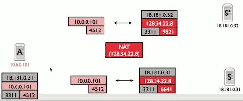

# 5 Application 

## NATs - Introduction

For example, wifi router

NAT rewrites source IP, source port. It sets up a mapping between these (internal port, IP) and (external port,IP).

- Two Questions
    1. What packets does a NAT allow to traverse mapping ?
    2. How and when does a NAT assign mappings ?

- kinds of NAT (  )
    - a1 Full Cone NAT
        - reguardless the source IP
        - 穿透性最好
    - a2 restricted Cone NAT
        - filter based on the source IP
    - a3 port restricted Cone NAT
        - filter based on both source IP and port
    - b  Symmetric NAT
        - 
        - **different destinations receive different mappings**
        - This type of NAT behaves in the same way of a Port-Restricted Cone NAT, with an important difference: 
            - for each outbound connection to a different remote IP tuple (i.e. to a different remote machine), the NAT assigns a new random source port on the external side.
        - 安全性最高

- 举例
    - NAT 内的主机 A ： IP 记为 A ，使用端口 1000
    - NAT 网关     ：   IP 记为 NAT ，用于 NAT 的端口池假设为（ 5001-5999 ）
    - 公网上的主机 B ： IP 记为B ，开放端口 2000
    - 公网上的主机 C ：   IP 记为C ，开放端口 3000

- Full Cone NAT 和 Symmetric NAT 的区别
    1. 如果是 Full Cone NAT, 那么成功连接后，状态必然如下：
        - A （ 1000 ） —— >  NAT （ 5001 ）—— >  B （ 2000 ）
        - A （ 1000 ） —— >  NAT （ 5001 ）—— >  C （ 3000 ）
        - 也就是说，只要是从 A 主机的 1000 端口发出的包，经过地址转换后的源端口一定相同。
    2. 如果是 Symmetric NAT, 连接后，状态有可能（注意是可能，不是一定）如下：
        - A （ 1000 ） —— >  NAT （ 5001 ）—— >  B （ 2000 ）
        - A （ 1000 ） —— >  NAT （ 5002 ）—— >  C （ 3000 ）

- 3种Cone NAT 之间的区别
    - 仍然以上面的网络环境为例，假设A先与B建立了链接:
        - A （ 1000 ） —— >  NAT （ 5001 ）——— >  B （ 2000 ）
    1. Port Restricted Cone NAT->端口限制锥形 NAT （ IP+Port 限制） :
        - 只有 B （ 2000 ）发往 NAT （ 5001 ）的数据包可以到达 A （ 1000 ）
        - B （ 2000 ） —— >  NAT （ 5001 ） ——— >   A （ 1000 ）
        - B （ 3000 ） —— >  NAT （ 5001 ） — X — >   A （ 1000 ）
        - C （ 2000 ） —— >  NAT （ 5001 ） — X — >   A （ 1000 ） 
    2. Restricted Cone NAT
        - 只要是从 B 主机发往 NAT （ 5001 ）的数据包都可以到达 A （ 1000 ）
        - B （ 2000 ） —— >  NAT （ 5001 ） ——— >   A （ 1000 ）
        - B （ 3000 ） —— >  NAT （ 5001 ） ——— >   A （ 1000 ）
        - C （ 2000 ） —— >  NAT （ 5001 ） — X — >   A （ 1000 ）
    3. Full Cone NAT
        - 任意地址发往 NAT （ 5001 ）的数据包都可以到达 A （ 1000 ）
        - B （ 2000 ） —— >  NAT （ 5001 ） ——— >   A （ 1000 ）
        - B （ 3000 ） —— >  NAT （ 5001 ） ——— >   A （ 1000 ）
        - C （ 3000 ） —— >  NAT （ 5001 ） ——— >   A （ 1000 ）
- Linux NAT is symmetric NAT
    - A （ 1000 ） —— >  NAT （ 1000 ）—— >  B （ 2000 ）
    - D （ 1000 ） —— >  NAT （ 1000 ）—— >  C （ 2000 ）
    - A （ 1000 ） —— >  NAT （ 1001 ）—— >  C （ 2000 ）
    - 第三条连接为了避免与第二条产生相同的 socket 而改变了源端口
        - socket 必须唯一

## Application 

### Incoming Connections 

- Connection Reversal 
    - A is under NAT,  B wants to connect to A
    - A create a connecton to R
        - B create a connection to R , tells R that he  wants to connect to A
    - R tells A that B wants connect to it , and then A opens a connection to B.
- Relays
    - A and B are both under their own NAT
    - A , B both open connection to R , and R forwards the traffic between A,B.
- NAT Hole-Punching 打洞
    - 不借助第三方服务器转发，直接通信
    - not work for symmetric NAT.

## NAT Operation Details

