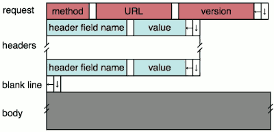
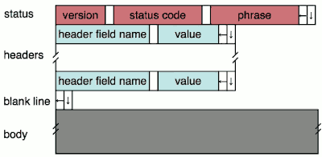
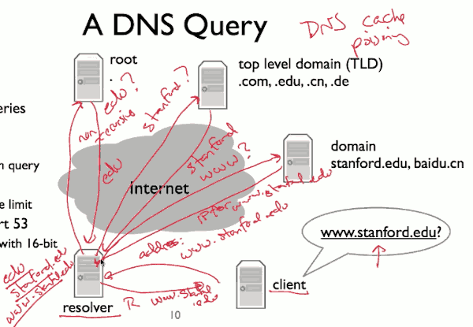

# 5 Application 

## NATs - Introduction

For example, wifi router

NAT rewrites source IP, source port. It sets up a mapping between these (internal port, IP) and (external port,IP).


- Two Questions
    1. What packets does a NAT allow to traverse mapping ?
    2. How and when does a NAT assign mappings ?

- kinds of NAT 
    - a1 Full Cone NAT
        - reguardless the source IP
        - 穿透性最好
    - a2 restricted Cone NAT
        - filter based on the source IP
    - a3 port restricted Cone NAT
        - filter based on both source IP and port
    - b  Symmetric NAT
        - 
        - **different destinations receive different mappings**
        - This type of NAT behaves in the same way of a Port-Restricted Cone NAT, with an important difference: 
            - for each outbound connection to a different remote IP tuple (i.e. to a different remote machine), the NAT assigns a new random source port on the external side.
        - 安全性最高

- 举例
    - NAT 内的主机 A ： IP 记为 A ，使用端口 1000
    - NAT 网关     ：   IP 记为 NAT ，用于 NAT 的端口池假设为（ 5001-5999 ）
    - 公网上的主机 B ： IP 记为B ，开放端口 2000
    - 公网上的主机 C ：   IP 记为C ，开放端口 3000

- Full Cone NAT 和 Symmetric NAT 的区别
    1. 如果是 Full Cone NAT, 那么成功连接后，状态必然如下：
        - A （ 1000 ） —— >  NAT （ 5001 ）—— >  B （ 2000 ）
        - A （ 1000 ） —— >  NAT （ 5001 ）—— >  C （ 3000 ）
        - 也就是说，只要是从 A 主机的 1000 端口发出的包，经过地址转换后的源端口一定相同。
    2. 如果是 Symmetric NAT, 连接后，状态有可能（注意是可能，不是一定）如下：
        - A （ 1000 ） —— >  NAT （ 5001 ）—— >  B （ 2000 ）
        - A （ 1000 ） —— >  NAT （ 5002 ）—— >  C （ 3000 ）

- 3种Cone NAT 之间的区别
    - 仍然以上面的网络环境为例，假设A先与B建立了链接:
        - A （ 1000 ） —— >  NAT （ 5001 ）——— >  B （ 2000 ）
    1. Port Restricted Cone NAT->端口限制锥形 NAT （ IP+Port 限制） :
        - 只有 B （ 2000 ）发往 NAT （ 5001 ）的数据包可以到达 A （ 1000 ）
        - B （ 2000 ） —— >  NAT （ 5001 ） ——— >   A （ 1000 ）
        - B （ 3000 ） —— >  NAT （ 5001 ） — X — >   A （ 1000 ）
        - C （ 2000 ） —— >  NAT （ 5001 ） — X — >   A （ 1000 ） 
    2. Restricted Cone NAT
        - 只要是从 B 主机发往 NAT （ 5001 ）的数据包都可以到达 A （ 1000 ）
        - B （ 2000 ） —— >  NAT （ 5001 ） ——— >   A （ 1000 ）
        - B （ 3000 ） —— >  NAT （ 5001 ） ——— >   A （ 1000 ）
        - C （ 2000 ） —— >  NAT （ 5001 ） — X — >   A （ 1000 ）
    3. Full Cone NAT
        - 任意地址发往 NAT （ 5001 ）的数据包都可以到达 A （ 1000 ）
        - B （ 2000 ） —— >  NAT （ 5001 ） ——— >   A （ 1000 ）
        - B （ 3000 ） —— >  NAT （ 5001 ） ——— >   A （ 1000 ）
        - C （ 3000 ） —— >  NAT （ 5001 ） ——— >   A （ 1000 ）
- Linux NAT is symmetric NAT
    - A （ 1000 ） —— >  NAT （ 1000 ）—— >  B （ 2000 ）
    - D （ 1000 ） —— >  NAT （ 1000 ）—— >  C （ 2000 ）
    - A （ 1000 ） —— >  NAT （ 1001 ）—— >  C （ 2000 ）
    - 第三条连接为了避免与第二条产生相同的 socket 而改变了源端口
        - socket 必须唯一

## Application 

### Incoming Connections 

- Connection Reversal 
    - A is under NAT,  B wants to connect to A
    - A create a connecton to R
        - B create a connection to R , tells R that he  wants to connect to A
    - R tells A that B wants connect to it , and then A opens a connection to B.
- Relays
    - A and B are both under their own NAT
    - A , B both open connection to R , and R forwards the traffic between A,B.
- NAT Hole-Punching 打洞
    - 不借助第三方服务器转发，直接通信
    - not work for symmetric NAT.


## HTTP

### HTTP format



- the blank means "space character"
    - left arrow means "return"
    - down arrow means "new line"
- Headers
    - `If-Modified-Since` this is a way for the client to tell the server to only give the document if it's been modified since that time. If the document has been modified since that time stamp the server responds "200 OK the new copy of the document",otherwise it responds with 304 not modified.
        - this header is useful when your client caches pages which most web browsers do rather than transfer the same document again and again. 





### HTTP/1.0

- Open connection
- Issue Get
- Server closes connection after response

### HTTP/1.1 Keep Alive

- Added **Connection** header for requests
    - keep-alive: tells the server "please keep this connection open,I'll request more"
    - close:  tells the server to close the connection
    - Server can always ignore
- Added **Connection** header for responses
    - keep-alive: tells the client it'll keep the connection open
    - close: tells the client it's closing the connection
- Added **Keep-Alive** header for responses
    - Tells client how long the connection may be kept open. 

Now the client can send further requests on the same connection. It can also open more connections, if it wants , but it doesn't have to.


## BitTorrent

BitTorrent allows people to share and exchange large files. A bittorrent client requests documents from other clients. So that single client can request from many others in parrllel. 

BitTorrent breaks files up into chunks of data called pieces. When a client downloads a complete piece from another client, it then tells other clients it has that piece so they can download it too. These collections of collaborating clients are called **swarms**.

### Torrent File 

A client joins a swarm by downloading a Torrent file that tells it information about the file, such as how big it is, the size of its pieces, and how to start contacting other clients.

- Torrent file (.torrent) describes file to download
    - Names tracker, server tracking who is participating
    - File length, piece length, SHA I hashes of pieces
    - Additional metadata( who created torrent, etc.)
    - Also specifies tracker
- Client contacts tracker, starts communicating with peers
- "Trackerless" torrents use something called a DHT(distributed hash table)
    - Information on swarm stored across many nodes
    - A distributed coordination mechanism. 
        - Rather than use a centralized table for this lookup, the mapping is actually distributed across all the participating nodes.
- What to say ?
    - Peers exchange metadata on what piecies they have
    - Download rarest pieces: rarest first policy
    - When down to the last few pieces, ask for them from multiple peers


## DNS

### HOSTS.TXT

- Originally, all hosts were in a file HOSTS.TXT, maintained by Network Information Center- Hosts periodically used a file transfer protocol to download new version
    - Requires n² network capacity, does not scale well.

### Domain Name System

- Map names to addresses (more generally, values)
- Must be albe to handle *huge* number of records
- Must have distributed control: people can control their own names
    - Stanford, you can manage names under Starford, but Amazon you can manage names under Amazon.
- Must be robust to individual node failures.


### Domain Name System Design 

- Two properties make DNS design feasible
    - Read-only or read-mostly database: hosts look up names much more often than update them. 
    - Loose consistency: changes can take a little while to propagate
- Two properties allow extensive caching 
    - Look up a name, keep result for a long time , and then use it to answer other queries.

### DNS Servers

- Hierarchical zone ( "root" zone, edu, stanford, scs )
- Each zone can be separately administered
    - Stanford can grant David Mazieres the domain SCS, so it'll answer questions about SCS. But then , David can completely control all of the host names underneath SCS. 
    - Similarly, EDU can grant Stanford the name Stanford, but then it's completely upto Stanford to manage all of the names beneath Stanford.
- Each zone served from serveral replicated servers
    - Rather than there's being one server that serves Stanford's name, there are in fact many servers, replicated, and there's some rules as to how they're replicated. 
- Root zone: 13 servers, highly replicated (a,b,c,...m)
    - Bootstrap: root server IPs are stored in a file on name server
    - Replicated through anycast (discussed later in course)

### A DNS Query

- 2 types of queries
    - Recursive
    - Non-recursive
    - Specified by bit in query
- UDP port 53
    - 512 byte message limit
- Can use TCP port 53
    - Prefix messages with 16-bit length field

- 

### Resource Records

- All DNS information represented in Resource Records (RRs):
    - `name [TTL] [class] type rdata`
    - name: domain name (e.g., www.stanford.edu)
    - TTL:  time to live (in seconds)
    - class: for extensibility, ususally In 1 (Internet )
    - type: type of the record
    - rdata: resource data dependent on type
- 2 critical RR types:  A (IPv4 address) and NS(name server) records
    - NS记录 解析服务器记录。用来表明由哪台服务器对该域名进行解析。这里的NS记录只对子域名生效。
    - 例如用户希望由12.34.56.78这台服务器解析news.mydomain.com，则需要设置news.mydomain.com的NS记录。
- dig tool


```bash
$ dig www.stanford.edu

; <<>> DiG 9.10.6 <<>> www.stanford.edu
;; global options: +cmd
;; Got answer:
;; ->>HEADER<<- opcode: QUERY, status: NOERROR, id: 65468
;; flags: qr rd ra; QUERY: 1, ANSWER: 5, AUTHORITY: 0, ADDITIONAL: 0

;; QUESTION SECTION:
;www.stanford.edu.		IN	A
 
;; ANSWER SECTION:
www.stanford.edu.	705	IN	CNAME	stanfordhs17.wpengine.com.
stanfordhs17.wpengine.com. 300	IN	CNAME	lbmaster-90886.wpengine.com.
lbmaster-90886.wpengine.com. 300 IN	CNAME	cluster90-elbwpeel-1jjv8xqi5kd5g-1169217295.us-east-1.elb.amazonaws.com.
cluster90-elbwpeel-1jjv8xqi5kd5g-1169217295.us-east-1.elb.amazonaws.com. 300 IN	A 34.231.182.179
cluster90-elbwpeel-1jjv8xqi5kd5g-1169217295.us-east-1.elb.amazonaws.com. 300 IN	A 35.175.160.108

;; Query time: 6 msec
;; SERVER: 192.168.1.1#53(192.168.1.1)
;; WHEN: Sun Apr 05 13:38:29 CST 2020
;; MSG SIZE  rcvd: 216
```

Besides an A record and NS record, there is something called the CNAME record, a canonical name.

### CNAME Record

- Canonical name record, tells you a name is an alias
    - `name [TTL] [class] CNAME cannoical-name`
    - Any record for canonical name can also be associated with name
    - Example: dig www.stanford.edu
- CNAME recludes any other RRs for name
- Answer can have other records for canonical name 

- 区别
    - A记录就是把一个域名解析到一个IP地址（Address，特制数字IP地址），而CNAME记录就是把域名解析到另外一个域名。
    - CNAME将几个主机名指向一个别名，其实跟指向IP地址是一样的，因为这个别名也要做一个A记录的。但是使用CNAME记录可以很方便地变更IP地址。


### MX Records

Anothe kind of DNS record is MX record.

- Mail eXchange record -- tells you mail server for a domain
    - 用于将以该域名为结尾的电子邮件指向对应的邮件服务器以进行处理
    - `name [TTL] [class] MX preference mail-server-name`
- Can't ping scs.stanford.edu, but you can send email to scs.stanford.edu
- MX records cause A record processing for mail-server-name
- Example: dig mx scs.stanford.edu
- What if mail-server-name does not have an A record ?
    - dig mx bad-mx.scs.stanford.edu

### Many Other kinds of Records

- SOA: Start of Authority
- TXT: arbitrary text (great for extensions)
- PTR: map address to name (PTR: pointer ?)
- AAAA: IPv6 address records


## DHCP

### Communicating with IP

- Need 3 things ( plus one)
    - IP address
    - Subnet mask
    - Gateway router
        - if the target node in not on the local subnet, what's the IP addrees of the next/first hop towards destinations outside of the local subnet. 
    - A DNS server IP address is also useful ( but not necessary for IP )
- Problem: how do we get these values ?


### DHCP

- Dynamic Host Configuration Protocol , RFC 2131
- A machine can request configuration from a DHCP server
    - Movement: just request configuration again
    - Configuration has a duration: a "lease", which can be renewed
    - Garbage collection: when lease expires
- Discover(client,broadcast), offer(server), request(client), ack(server), release


