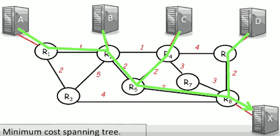
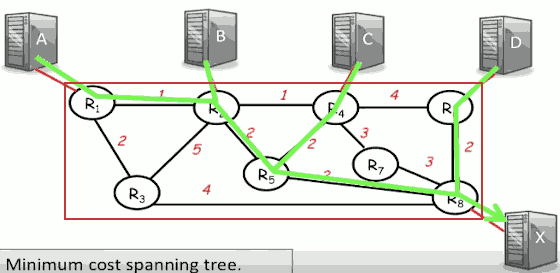
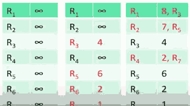
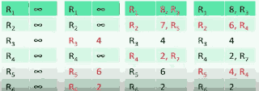
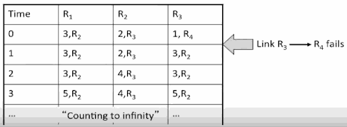

# Week6 Routing

## The Basics

- Approaches 
    - Flooding
    - Source routing
        - `...|B|R₃R₂R₁`
        - A knows the topology, it knows the order in which it wants the routers to be visited. 
    - Forwarding table
    - Spanning tree
        - When populating the forwarding tables with entries, it's often the goal to create what we call the spanning tree. 
        - The spanning tree is used in order to create the routing entries so that we can populate the forwarding tables and therefore route paths along that spanning tree.
        - 
- Metrics
    - When calculating the spanning tree, we need to know what our objective is, or what our metrics of success are. How do we know, amongst all of the possible spanning trees, which one we're going to pick ? 
    - Choices 
        - Min distance
        - Min hop-count
        - Min delay
        - Max throughput
        - Least-loaded path
        - Most reliable path
        - Lowest cost path
        - Most secure path
        - ... 
- Shortest path spanning trees
- Other type of routing 
    - Multipath
        - The downside of the shortest path spanning tree is that some links can become very popular, and could become congested. 
        - So it means that we might need to keep adapting the algorithm. An alternative would be, instead of adapting the algorithm, from the beginnings spread all of the traffic over all of the links. 
    - Multicast
        - So far, we have assumed that all packets are going to a single destination, something we call unicast. 
        - In some applications, an end host might want to send packets to a set of hosts. 

## Distance Vector Protocol:  Bellman Ford algorithm

Distance vector protocol is a way in which the routers maintain a vector of their distances to a given, or to all of the other routers, and then iteratively, through a distributed algorithm, they converge on finding the shortest path or the lowest cost spanning tree from them to every other router.

And we're going to see a specific example of this, what's known as the Bellman Ford algorithm, which is the most commonly used algorithm in these distance vector protocols.

So the particular problem we're going to address is how can routers work together to find the minimum cost spanning tree.  Notice that this is equivalent to finding the minimum cost spanning tree amongst just the routers.

 

### The distributed Bellman-Ford Algorithm 

Example: Find min-cost spanning tree to R₈.

In general, all of the routers are going to be building the lowest cost spanning tree to reach all of the other routers. We're just taking one specific case here of finding that minimum cost spanning tree to R₈.

In the Bellman Ford algorithm, we're going to assume that the routers know the cost of the link to each of their neighbors so that there is a metric and a cost associated with using that link. 

Router Rᵢ maintains value cost Cᵢ to reach R₈.

Vector C̲ = (C₁,C₂,...,C₇) is the distance vector to R₈.

- initially, set C̲ = (∞,∞,...∞)
    1. After T seconds, Rᵢ sends Cᵢ to its neighbors.
    2. If Rᵢ learns lower cost path, update Cᵢ
    3. Repeat

Just as an example, R₁ had learned that it can get to R₈ via R₃ at a cost of 8. So it has that value `8,R₃`.

In the next iteration, R₂ which previously thought that the lowest cost is 7, it's going to learn about this 3 hop path because R₄ is going to advertise to it, the value 6.

- Questions
    1. What is the maximum run time of the algorithm?
        - It's going to be the hop count of the longest loop free path
    2. Will the algorithm always converge ?
        - YES
    3. What happens when link costs change, or when routers/links fail?
        - In general, it will continue to converge 

### A problem with Bellman-Ford

"Bad news travels slowly"

There's a fairly simple fix to this.

1. Set infinity = "some small integer" (e.g. 16). 
    - Stop when count = 16.  If you get to a count of 16, it actually means that there's no path at all.
2. Split horizon: Because R₂ received lowest cost path from R₃, it does not advertise cost R₃.
    - So R₃ will never think that it can reach R₄ via R₂.
3. Split-horizon with poison reverse: R₂ advertises infinity to R₃.
4. There are many problems with ( and fixes for) the Bellman-Ford algorithm.

## Link State Protocol: Dijkstra's shortest path first algorithm

