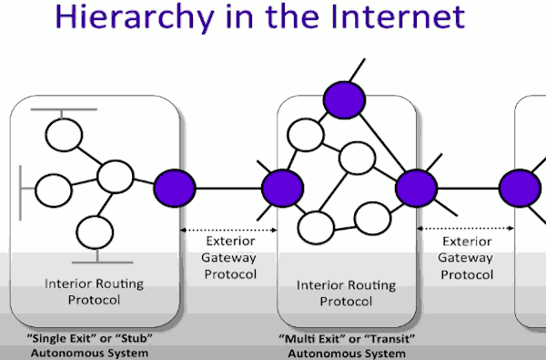
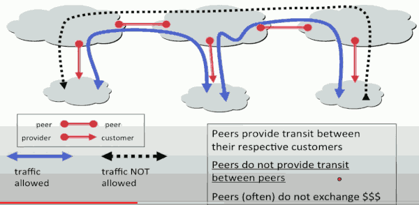
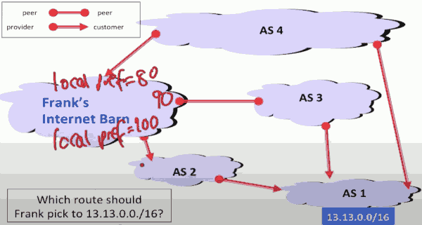
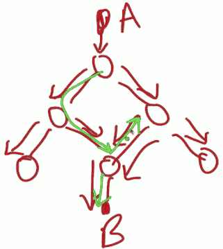

# Week6 Routing

## The Basics

- Approaches 
    - Flooding
    - Source routing
        - `...|B|R₃R₂R₁`
        - A knows the topology, it knows the order in which it wants the routers to be visited. 
    - Forwarding table
    - Spanning tree
        - When populating the forwarding tables with entries, it's often the goal to create what we call the spanning tree. 
        - The spanning tree is used in order to create the routing entries so that we can populate the forwarding tables and therefore route paths along that spanning tree.
        - 
- Metrics
    - When calculating the spanning tree, we need to know what our objective is, or what our metrics of success are. How do we know, amongst all of the possible spanning trees, which one we're going to pick ? 
    - Choices 
        - Min distance
        - Min hop-count
        - Min delay
        - Max throughput
        - Least-loaded path
        - Most reliable path
        - Lowest cost path
        - Most secure path
        - ... 
- Shortest path spanning trees
- Other type of routing 
    - Multipath
        - The downside of the shortest path spanning tree is that some links can become very popular, and could become congested. 
        - So it means that we might need to keep adapting the algorithm. An alternative would be, instead of adapting the algorithm, from the beginnings spread all of the traffic over all of the links. 
    - Multicast
        - So far, we have assumed that all packets are going to a single destination, something we call unicast. 
        - In some applications, an end host might want to send packets to a set of hosts. 

## Distance Vector Protocol:  Bellman Ford algorithm

Distance vector protocol is a way in which the routers maintain a vector of their distances to a given, or to all of the other routers, and then iteratively, through a distributed algorithm, they converge on finding the shortest path or the lowest cost spanning tree from them to every other router.

And we're going to see a specific example of this, what's known as the Bellman Ford algorithm, which is the most commonly used algorithm in these distance vector protocols.

So the particular problem we're going to address is how can routers work together to find the minimum cost spanning tree.  Notice that this is equivalent to finding the minimum cost spanning tree amongst just the routers.

 

### The distributed Bellman-Ford Algorithm 

Example: Find min-cost spanning tree to R₈.

In general, all of the routers are going to be building the lowest cost spanning tree to reach all of the other routers. We're just taking one specific case here of finding that minimum cost spanning tree to R₈.

In the Bellman Ford algorithm, we're going to assume that the routers know the cost of the link to each of their neighbors so that there is a metric and a cost associated with using that link. 

Router Rᵢ maintains value cost Cᵢ to reach R₈.

Vector C̲ = (C₁,C₂,...,C₇) is the distance vector to R₈.

- initially, set C̲ = (∞,∞,...∞)
    1. After T seconds, Rᵢ sends Cᵢ to its neighbors.
    2. If Rᵢ learns lower cost path, update Cᵢ
    3. Repeat

Just as an example, R₁ had learned that it can get to R₈ via R₃ at a cost of 8. So it has that value `8,R₃`.

In the next iteration, R₂ which previously thought that the lowest cost is 7, it's going to learn about this 3 hop path because R₄ is going to advertise to it, the value 6.

- Questions
    1. What is the maximum run time of the algorithm?
        - It's going to be the hop count of the longest loop free path
    2. Will the algorithm always converge ?
        - YES
    3. What happens when link costs change, or when routers/links fail?
        - In general, it will continue to converge 

### A problem with Bellman-Ford

"Bad news travels slowly"

There's a fairly simple fix to this.

1. Set infinity = "some small integer" (e.g. 16). 
    - Stop when count = 16.  If you get to a count of 16, it actually means that there's no path at all.
2. Split horizon: Because R₂ received lowest cost path from R₃, it does not advertise cost R₃.
    - So R₃ will never think that it can reach R₄ via R₂.
3. Split-horizon with poison reverse: R₂ advertises infinity to R₃.
4. There are many problems with ( and fixes for) the Bellman-Ford algorithm.

## Link State Protocol: Dijkstra's shortest path first algorithm

In this video I'm going to tell you about the link state algorithm, in particular Dijkstra's Shortest-Path first algorithm. This is an example of a link-state protocol where the router start flooding to each other the all the information about the topology of the network: whick links are there, which links are up, which ones are down. And then from there each router is going to calculate its shortest path tree from it to every other router. 

### Dijkstra's shortest path first algorithm ( example of a "Link State Algorithm")

1. Exchange link state: A router floods to every other router the state of links connected to it.
    - In other workds , they're going to learn the topology of the network by exchanging with each other the state of the links connected to each router. So every router has a full topology map. 
    - Periodically
    - When link state changes
2. Run Dijkstra: Each router independently runs Dijkstra's shortest path first algorithm. 

At the end each router finds min-cost spanning tree to every other router. 

Questions:

1. How long does the algorithm take to run ?
    - By the end of the kth iteration, we've added K routers to the graph.
2. What happens when link costs change, or when routers / links fail ?
    - every time there's a change in the link state (up or down), the routers are going to flood that state to every other routers in the network. 
    - They then rerun Dijkstra's algorithm, calculate the lowest cost spanning tree from scratch. 

## Internet (RIP,OSPF) AS's

- Outline
    - Hierarchy and Autonomous System (AS)
    - Interior Routing Protocols
        - within those autonomous systems, how we use the distance vector and link-state algorithms
    - The structure of the Internet

### Autonomous Systems 

- The basic unit of hierarchy in the Internet
    - Within an AS, the owner decides how routing is done
    - Between AS's, must use BGP-4 (Border Gateway Protocol, v4)
- Finding and AS number
    - Query DNS to find IP address at Stanford: `dig stanford.edu`
        - Returns: "stanford.edu  1800 IN A 171.64.13.26"
    - Find AS for IP address: `nc whois.cymru.com 43`
        - Enter: 171.64.13.26
    - Stanford(32), AT&T(797), Google(15169,22859,36039)
    - `traceroute -a <destination>`  will report AS numbers.

### Interior Routing Protocols

- RIP(Routing Information Protocol)
    - Use distance vector (distributed Bellman-Ford algorithm)
    - Internet RFC 2453
    - Updates send every 30 seconds
    - No authentication for updates
    - Originally in BSD UNIX, routed
    - Widely used for many years; used less now.

- OSPF
    - Link-state updates sent(using flooding) as and when required
    - Internet RFC 2328
    - Every router runs Dijkstra's algorithm
    - Authenticated updates
    - Autonomous system may be partitioned into "areas".
    - Widely used, complex.
    - IS-IS(RFC 1142) is similar, and is also widely used.

### Routing to a single exit point 

- There is only one exit point, so routers within the AS can use default routing
    - Each router knows all prefixes within AS
    - Packets from another AS are sent to the default router
    - Default router is the border gateway to the next AS.
- Routing tables in single exit AS's tend to be small.
    - because each router only needs to hold the addresses for the prefixes within its autonomous system. Otherwise it just forwards them out. Nice and easy.

### Routing to multiple exit points

- Used by multi-homed enterprises and transit AS's.
- Each internal router must be told which exit point to use for a given destinantion prefix.
    - That means when it sees a prefix which is not inside the autonomous system, it has to know which exit point to use. 
- Requires large routing tables to route to every prefix. 
- This can can actually be made a little simpler if the autonomous system uses what's called hot-potato routing. 

- Approach 1: Hot-potato routing -- send to closest exit.
    - Instead of making a smart choice , it simply sends to the closest exit point. 
Approach 2: Pick exit closest to destination.
    - The more elaborate way would be to pick the exit, which is closest to the destination, or is on the lowest cost path.

### Exterior Routing Protocol

- Every AS must interconnect to other AS using BGP-4
    - just like we're required to use IP, in order to deliver our packets, the thin waste of routing protocols is BGP4. 
- Problems BGP-4 designed to solve
    - **Topology**: The internet is a complex mesh of different AS's with very little structure.  It's very unstructured interconnection mesh.
    - **Autonomy of AS's**: Each AS defines link costs in different ways, so not possible to find lowest cost paths. 
        - we're simply going to have to find a set of paths based on the number of autonomous systems. 
    - **Trust**: Some AS's don't trust others to advertise good routes(e.g. 2 competing backbone providers), or to protect the privacy of their traffic(e.g. 2 warring nations.)
    - **Policies**: Different AS's have different objectives (e.g. route over fewest hops; use one provider rather than another ).

- BGP-4 is designed to work in a way that will allow for that policy to be a local, private matter for the autonomous system. 

### Summary

- The Internet consist of multiple AS's each managed independently.
- An AS runs its own interior routing protocol.
- Stub AS's use simple default routing 
- AS's with multiple exits must decide the best exit.
- AS's must connect using the BGP-4 protocol.

## Routing BGP (Border gateway protocol)

- BGP is not a link state or a distance vector routing protocol. 
    - Instead, it uses what's called a path vector. 
- BGP routers advertise complete paths ( that path is a list of AS's passed through in order to reach a particular destination prefix.)
    - Also called AS_PATH (this is the path vector)
    - Example of path advertisement:
        - "The network 171.64/16 can be reached via the path(AS1,AS5,AS13)".
        - So that might be an example of advertisement that the BGP might advertise to one of its neighbors. 

- The consequence of sending out a path, is that paths with loops are easily detected locally, and you can simply remove those , or just completely ignore those advertisements.
- Perhans the most important feature of BGP is that local policies that are private and secret to a particular AS, can pick the preferred path among those that advertised to it. 
    - So, if a number of neighboring AS advertise different paths to reach the same prefix, then the local policy can pick whichever one it chooses. whichever one it wants. 
- When a link/router fails, the path is "withdrawn".

### Provider and Customer

**The peering Relationship**

In general , a peer cannot be a transit for its other peers.  In other words, the black-dotted path is not allowed because it's going through the middle peer.

That's because typically the relationship here between 2 peers is settlement free. So peers do not provide transit between 

---

## Routing -- Multicast Routing

### Multicast 

- Techniques and Principles
    - Reverse Path Broadcast (RPB) and Rruning
    - One versus multiple trees
- Practice
    - IGMP -- group management
    - DVMRP -- the first multicast routing protocol
    - PIM -- protocol independent multicast

### Flooding

We already saw one way in which packets could be delivered to a large number of hosts with a rather simplisitc  approach of flooding.

If we use flooding as an approach, form A to reach B, then packets from A could simply be replicated at each router along the path by sending tou every interface except the one through which the packet arrived. 

The basic problem in the flooding is that when there are loops in the topology, packets can loop forever.

We saw in the spanning tree protocol how these loops were broken. We can look a different way they can be avoided in the first place.  That approach is called Reverse Path Broadcast (RPB), aka Reverse Path Forwarding (RPF)

### Reverse Path Broadcast (RPB)

