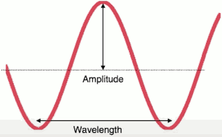
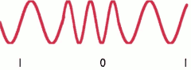

...menustart

- [Week 7: Physical and Link Layer](#b29bbe60413cd9100a74d9743f6b1de6)
    - [Shannon Capacity and Modulation](#7f0c39ec80c0829b6fe3db7a1f63f090)
        - [Shannon Limit](#dceee212b048dddcfa500e6f39c08123)
        - [Analog Signals](#46d9d83325615b7d97aea31410c1bf5e)
        - [Modulation: ASK, FSK](#9cd75fbf61eb12241b50969e4900c9b9)
        - [Amplitude Shift Keying](#139b184467fe5b1aadf2e8f11944e1e1)
        - [Modulation: PSK](#ca1841cf442c49c2bec4fef1c24b1ba2)
        - [TODO ...](#dde7b2c0e90a2ea977a549fa578014f4)

...menuend

<h2 id="b29bbe60413cd9100a74d9743f6b1de6"></h2>

# Week 7: Physical and Link Layer

<h2 id="7f0c39ec80c0829b6fe3db7a1f63f090"></h2>

## Shannon Capacity and Modulation

- Capacity
    - how many bits pert second a given physical layer can support
- Modulation
    - how is it you represent these bits on the medium itself.

<h2 id="dceee212b048dddcfa500e6f39c08123"></h2>

### Shannon Limit 

- There is a theoretical limit on how information a channel can carry (Shannon limit)
- Channel capacity = B log₂(1+S/N)
    - B is Bandwidth, S is Signal strength, N is Noise
- Higher S/N requires lower noise (better/more expensive hardware), or stronger signal (higher voltages)
- Building hardware for very high bandwidths is difficult

<h2 id="46d9d83325615b7d97aea31410c1bf5e"></h2>

### Analog Signals 

- Frequency: 1/wavelength 
    - Speed of light ~ 1 foot/nanosecond , 1 billion ft/s
    - that is, wavelength = 1ft means 1GHz
- Bandwidth: size of frequency range
    - wifi 802.11b , channel 1~11, each channel 20MHz wide 
- Phase: timing of waves within a wavelength
- Amplitude: loudness, how loud is the signal strength

<h2 id="9cd75fbf61eb12241b50969e4900c9b9"></h2>

### Modulation: ASK, FSK

So given waves, there's a whole bunch of ways we can represent bits. The simplest ways is Amplitude Shift Keying(ASK).  This process is called modulation. How do I take a signal or take a particular bit of piece of data and then modulate my waves to represent that singal.

For this example,  0 has the small amplitude and 1 has a larger amplitude. So I want to send 0 I send the smaller wave ,and I want to send 1,  I send the larger wave.

Another approach is called frequency shift keying(FSK).  We're used to separate frequencies.

The 0 happens to be the higher frequency , the 1 is the lower frequency.

<h2 id="139b184467fe5b1aadf2e8f11944e1e1"></h2>

### Amplitude Shift Keying 

- ASK works well in wired networks because signal strength does not decrease much with distance
    - Used in most common wired Ethernet systems
- PAM-5: five level pulse amplitude modulation (-2,-1,0,+1,+2)
    - Used in 100BASE-T and 1000BASE-T Ethernet (100Mbps and gigabit)
- PAM-16: 16 level pulse amplitude modulation
    - Used in 10GBASE-T Ethernet (10 gigabit)

<h2 id="ca1841cf442c49c2bec4fef1c24b1ba2"></h2>

### Modulation: PSK

Another form of modulation that's really popular is Phase Shift Keying(PSK). PSK adjust the phase of the waves. 

- PSK works well when there can be significant variations in signal strength 
    - DSL, cable modems, wireless all use phase shift keying
- Binary phase shift keying (BPSK)
    - 2 phases: (0,π)
    - Used in 1Mbps and 2Mbps 802.11b(WiFi)
- Quadrature phase shift keying (QPSK)
    - 4 phahses: (0,π/2, π,3π/2)
    - Used in 5.5Mbps and 11Mbps 802.11b (WiFi)

<h2 id="dde7b2c0e90a2ea977a549fa578014f4"></h2>

### TODO ...

