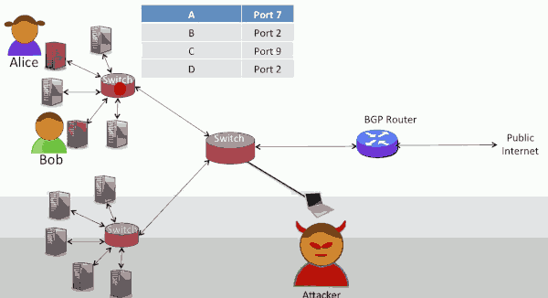
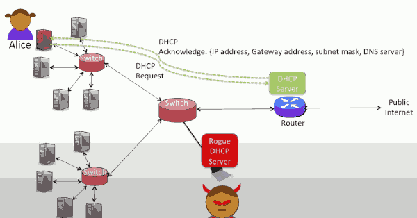
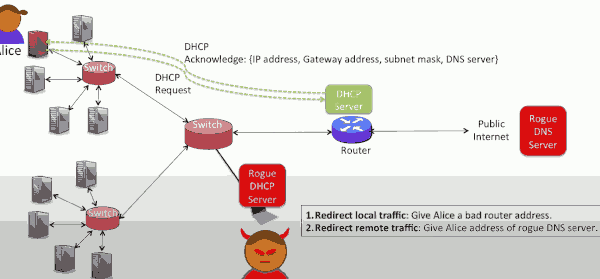
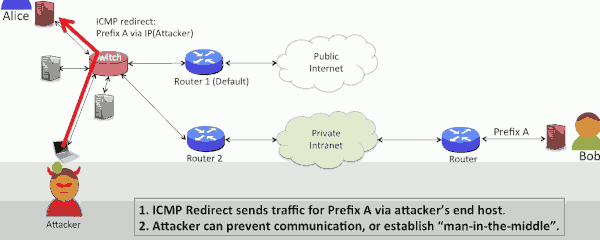
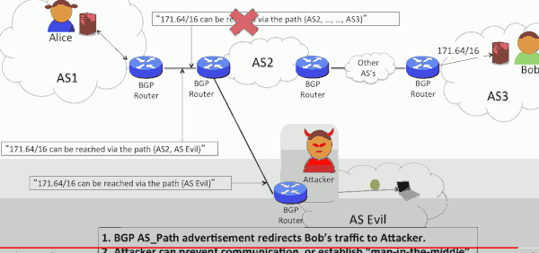

# Week8 : Security

## 8.1 Introduction

### How can communication be compromised ?

1. Eavesdrop -- passively "sniff" and record network data ( or metadata ). For example:
    - Passively tap an electrical or optical cable
    - Listen to Wifi ( as we did in class, using Wireshark )
        - because the packets are broadcast for everyone to hear.
    - Compromise a router to duplicate and forward data
2. Modify, delete, instert -- Actively tamper with our data by:
    - Changing contents of packets
    - Redirect packets to anothe server
    - Take over control of an end-host
3. Prevent communication -- Usually called "denial of service".

### What we want 

1. Secrecy/confidentiality: No one can listen-in to our communication. We will study encryption.
2. Integrity -- Our message are not altered in transit. We will study message authentication codes (MACs).
3. Authentication -- Confirm the identity of the other party. We will study digital signatures and certificates.
4. Uninterrupted communication -- We don't want someone to prevent us from communicating. 


### Types of attack 

1. Eavesdropping
2. Redirecting Ethernet, IP and DNS traffic
3. Hijacking a running TCP connection.
4. Denial of service

## 8.2 Layer 2 Attacks

### Common types of attack at Layer 2

1. Eavesdropping with an interface in promiscuous mode
    - quite easy if we put our network interface into promiscuous mode
    - in promiscuous mode, your network interface will capture all of the packets passing by, not just those addressed to your Ethernet address. 
    - Computers allow this mode of operation so that they can act as an Ethernet switch
    - for example, Linux comes with Ethernet switching code builtin. When wireshark runs it first puts your interface into promiscuous mode so it can see all the packets. 
    - This is particularly easy in a WiFi network and early Ethernet networks where packets were broadcast onto a single shared link.
    - Doesn't work so well with modern Ethernet networks that use Ethernet switches, because packets are usually private to the links between the source and the destination. 

2. Force packets to be broadcast -- then use methed(1)
    - force packets to be broadcast in any Ethernet network by overflowing the forwarding tables.  We do this by preventing the switch from learning addresses correctly. 
    - Once we have forced then to be broadcast, we can then eavesdrop using Wireshark.

3. Masquerade as DHCP or ARP server -- redirect packets to a different end-host

---

- How can the attacker persaude the swith to broadcast packets ?
    - It can keep filling up the forwarding table with other addresses. 
    - what can attacker can do is keep sending -- at very high rate -- packets with new Ethernet addresses. The switches will learn these addresses, displacing entries already in the switches, the table will keep evicting the entries for Alice and Bob. All the packets will then be be broadcast, and will be seen by the attacker.
    - 
    - This is called a MAC overflow attack.

### DHCP and DNS Masquerade

The attacker is going to try and persuade you to use a rogue DHCP server instead. 

Recall: When your computer is boots or first attaches to the network, your computer sends out a sequence of broadcast discovery packets to find the DHCP server. which is usually hosted on the nearest router.

After your computer has found the DHCP server, it sends a request, asking to be allocated an IP address on the local network, along with the address of the default router and the addresses of the DNS servers it should use. 

If the rogue DHCP server can respond faster than the legitimate server, it can respond faster than the legitimate server, it can respond to Alice first, giving here whatever configuration information it wants. 


For example, the attacker can give Alice a bad router address, so he sends traffic to the attacker instead of the router.  This makes it easy for the Attacker to set up a main in the middle attack.



A second way is for the attacker to give Alice the IP address of a remote rogue DNS server. When Alice looks up IP addresses in future -- for example, next time she visits google.com -- the rogue DNS server can return the IP address of a different server, and intercept Alice's traffic.




### ARP Masquerade

Finally, the attacker can set up a rogue ARP server. When Alice is sending packets to a local host, or via the router, she will first send an ARP request to find out the Ethernet address of the next hop. 

First she sends a broadcast ARP request packet to the ARP server, which replies with the legitimate Ethernet address she is looking for.

But if the attacker  sets up a rogue ARP server that responds faster than the legitimate ARP server, the attacker can give Alice the wrong information. If the attacker replies with the ethernet address of a rogue server in the local network, then all of Alice's traffic will be sent to the rogue server. This is an easy way to setup a man in the middle attack. 

## 8.2 Demo Attack

- Alice 10.0.0.1
- Bob   10.0.0.2
- Evil  10.0.0.3

```bash
# alice is ping Bob
ping 10.0.0.2

# evil can see any traffic
tcpdump -n host 10.0.0.1

# now evel run a script to 
# filling up the forward table 
# Alice's packet start broadcast...
```

---

DHCP attack ...


## 8.3 Layer 3 Attacks

1. Use ICMP to tell source end-host to redirect traffic
    - Send ICMP redirect messages to source host
    - recall: ICMP is used to convey information from the network back to source, telling it how the network is doing. 

2. BGP hijacking 
    - BGP attacks take advantage of the fact that neighboring ISPs trust one another to provide accurate information about the AS path to follow in order to reach the destination prefix. 
    - ISP advertise prefix belonging to someone else; capturing their traffic
    - ISP advertise invalid ISP path, creating "black hole" for traffic
    - requires masquerading as ISP, or taking over BGP TCP session.

3. More specific prefix.
    - Insert more specific prefix to divert a portion of an address space.
    - requires masquerading as ISP, or taking over BGP TCP session.


### ICMP Redirect



Alice is connected to her company's network which is connected to the public internet via Router 1. Alice wants to send a packet to her colleague Bob who works at the same company. They connected via the company's private network. 

Alice's computer is configured with router 1 as the default router. In other words packets destined for different subnet will be sent via router 1. But actually her packets to Bob should really go via router 2 instead. 

When the packet arrives to router 1, it notices the packet is routed back to the interface it arrived on. This tells router 1 that Alice sent the packet to the wrong router. So router 1 forwards the packet to router 2, and then sends an ICMP redirect message to Alice to tell her to send packets to Bob via router 2 in future. 

Alice's computer adds a new routing entry in its local routing table.  Next time Alice has a packet for Bob her computer sends it to router 2 instead. 

This is how ICMP redirects are supposed to work. 

The attacker can send an ICPM redirect message to tell her to route packets to `prefix-A` via the attacker's computer instead. 


### BGP Attacks

- Security vulnerabilities in BGP
    1. An AS can advertise IP address it doesn't own
    2. An AS cannot verify that an ASpath is correct
    3. ISPs exchange BGP message over a regular TCP session
- Almost any ISP can bring down the Internet
    - accidentally or maliciously 


### Some Examples

- 2008: Pakistan Telecom
    - tried to block access to YouTube
    - inadvertently propageted false BGP advertisements
- 2004: Turkish ISP -- TTNet
    - TTNet sent full BGP routing table; best path via Turkey to everywhere
    - Almost entire Internet routed via Turkey
    - Most of Internet inoperational for several hours
- 2008: Brazil
    - CTBC sent full BGP routing table that almost hijacked other carriers
    - Luckily, a BGP monitor noticed in time
    - Believed by many to be malicious (to block Yahoo).

### BGP Hijacking



Alice in AS1 sends her packets to Bob who is attacked to prefix A somewhere in AS3. 

Alice's neighboring AS, AS2, advertises correctly that the best path to Bob is via AS2. 

The Attacker has a different idea. The attacker is able to take over and control the BGP in AS Evil. Once the attacker has control over the BGP sessions between AS Evil and AS2 , it can advertise new false ASpath.   For example it can advertise a path saying that the 171.64/16 can be reached via AS Evil instead.

AS1 is no way of knowing that this is a lie and so might start routing traffic to AS Evil instead. 


## 8.4

### Denial of Service

- In Feb. 2000, Yahoo's router kept crashing
    - Engineers had problems with it before, but this was worse
    - Turned out they were being flooded with ICMP echo replies
    - Many DDoS attacks followed against high-profile sites
- Basic Denial of Service attack
    - Overload a server or network with too many packets
    - Maximize cost of each packet to server in CPU and memory
- Distributed Dos (DDos) particularly effective:
    - Penetrate many machines in semi-automatic fashion
    - Make hosts into "zombies" that will attack on command
    - Later start simultaneous widespread attacks on a victim


### DoS attack overview

- Class of attacks that just target availability
- Many motivations for Denail of Service (DoS)
    - Extortion
    - Revenge -- Spammers permanently shut down anti-spam company Blue Security
    - Bragging rights
- Can DoS at many different layers
    - Link, Network, Transprot, Application, ...

### Warm up: simple DoS attacks

- Jam a wireless network at physical layer
    - Simple, maybe even with off-the-shelf cordless phone
- Exploit NAV structure at 802.11 link layer
    - NAV (Net Allocation Vector) used to suggest when network may be free( e.g. "after RTS/CTS exchange")
    - Use to reserve net repeatedly for max number of seconds 
        - at that point, no one will end up transmitting, you have effectively disabled that wireless network.
- Flooding attack -- e.g., flood ping
    - `ping -f ...`
- Amplification can make attacks more powerful than resources directly available to attacker

### TODO

---

## 8.5 Security Principles

1. Confidentiality
2. Integrity
3. Availability

### Basic problem

- To first approximation, attackers control the network
    - can snoop, replay, suppress, send
- How do we defend against this ?
    - Communication securely despite insecure networks -- cryptography
    - Secure small parts of network despite insecurity of wider network
    - Design systems to scale well in response to attacks
        - 
- Two approaches: cryptography and scalable system design


### Cryptography

- Confidentiality
    - I want to tell you someting secretly, so no-one else knows what I said
    - Perfect confidentiality: one-time pad
        - You and I share a prefectly random key of 0s and 1s, K, nobody else has it
        - I XOR my message M with K, producing C, send C to you(C=M⊕K)
        - you XOR C with K, reconstructed M (M=C⊕K)
    - Advantages: informationally theoretic secure and fast
        - Given any C, and M is equally likely
    - Disadvantage: need a K as long as all data I might ever send
- Integrity
    - I want to make sure you received my message unchanged/untampered
    - I want to make sure you sent the message
    - Crytographic hash: H(M)
    - Message authentication code: MAC(M,K)
        - use key K to generate MAC(M,K), use K to check MAC(M,K)
- Authenticity
    - I want to be sure you are whom you say you are.
    - We've exchanged a secret K beforehand: MAC("This is the...",K)
    - If we haven't: chain of trust
        - We can trust Verisign by design(root of trust)
        - Verisign says "here's a secret for Stanford"
        - Standford says "here's a secret for the provost"

### High Availability Design

- Denail of service (Dos), Distributed Denail of Service (DDoS)
- Many kinds of attacks, many defenses
    - Replication (scale-out)
    - Keeping costs symmetric
    - Upstream filtering(stop letting those pings through, router!)
- Continual arms race: not going to talk much about it.


## 8.6 Confidentiality (TODO)

- Symmetric Encryption 
    - Examples: AES, Blowfish, DES, RC4
- One-Time pad
    - generally impractical
    - why it called one-time pad ?
        - because if you use same K encrypt 2 messags, then
        - C1 = K⊕M1, C2 = K⊕M2
        - C1⊕C2 =(K⊕M1)⊕(K⊕M2) = M1⊕M2 , it leaks some informations about M1 and M2

- Idea: Computational Security
    - So one-time pads are generally impractical. Instead what we want is a cryptosystem where we can distribute a small K, say 128 or 256 bits. 
    - Use K to encrypt much large M.
    - Given C=E(K,M), may be only one possible M. 

- Ciphers
    - Stream ciphers: pseudo-random pad
    - 1:06


## 8.7 Integrity

- Secrecy Is Not Enough
    - Encryption protects someone from reading plaintext
    - An adversary can still modify messages
- Integrity: protecting message from tampering and modificaiton
- Confidentiality without integrity is rare(and a sign of a poor design), while integrity without confidentiality is common

### Two Integrity Example

- Cryptographic hashes
    - Way to verify that data has not been modified
    - Requires no secrets: anyone can generate one
    - Useful in data storage
- Message authentication codes (MACs)
    - Way to verify that data has not been modified
    - Also verifies generator has secret key: authenticity
    - Useful in networks


